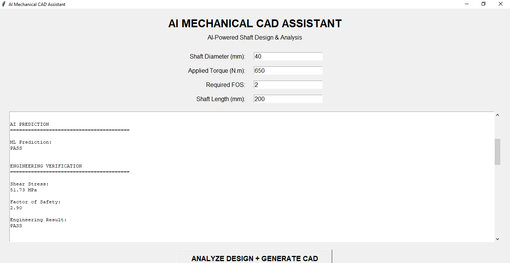
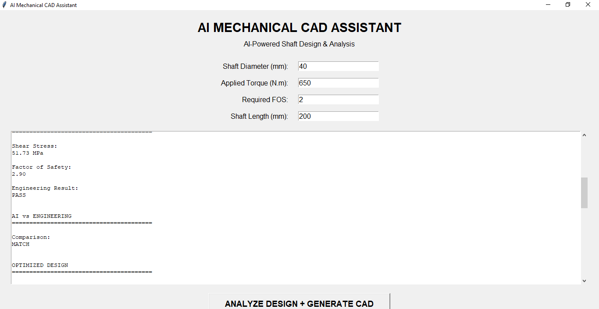
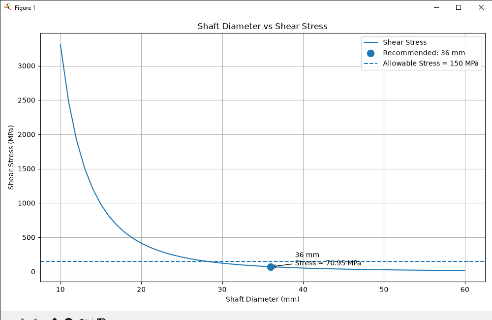

# AI Mechanical CAD Assistant

**AI-assisted mechanical shaft analysis, design optimization, visualization, and automated CAD generation.**

## Overview

The **AI Mechanical CAD Assistant** is an educational and research-oriented engineering prototype that combines classical mechanical engineering calculations, machine learning, design optimization, visualization, and automated CAD generation.

The current version focuses on the analysis and preliminary design optimization of **solid circular shafts subjected to torsional loading**.

The system allows a user to enter:

- Shaft diameter
- Applied torque
- Required factor of safety
- Shaft length

It then:

1. Uses a machine-learning model to predict whether the design passes or fails.
2. Independently verifies the design using classical torsion equations.
3. Compares the ML prediction with the engineering calculation.
4. Searches for a smaller shaft diameter that satisfies the required factor of safety.
5. Verifies the optimized design.
6. Generates a CAD drawing of the shaft.
7. Visualizes the shaft geometry.

---

## Project Workflow

```text
USER INPUT
     │
     ▼
AI/ML PREDICTION
     │
     ▼
ENGINEERING VERIFICATION
     │
     ▼
ML vs ENGINEERING COMPARISON
     │
     ▼
DESIGN OPTIMIZATION
     │
     ▼
OPTIMIZED DESIGN CONFIRMATION
     │
     ▼
CAD GENERATION
     │
     ▼
SHAFT VISUALIZATION
```

---

## Engineering Problem

### Problem Statement

A mechanical shaft is commonly used to transmit rotational power and torque between components such as motors, gears, pumps, turbines, compressors, and other rotating machinery.

When torque is applied to a shaft, the shaft experiences **torsional shear stress**.

The shaft must therefore be designed with a sufficient diameter so that the resulting shear stress remains within an acceptable limit and the required factor of safety is maintained.

At the same time, unnecessarily increasing the shaft diameter increases material usage, weight, and potentially manufacturing cost.

This creates an engineering design problem:

> **What is the smallest practical shaft diameter that can safely transmit the required torque while satisfying the required factor of safety?**

This project uses classical mechanical engineering equations to answer that question and then combines the engineering calculations with machine learning, optimization, visualization, and automated CAD generation.

### Torsional Loading

The current version of the project focuses on a **solid circular shaft subjected to torsional loading**.

The general torsion relationship is:

$$
\tau = \frac{Tr}{J}
$$

Where:

- $\tau$ = shear stress
- $T$ = applied torque
- $r$ = radial distance from the shaft center
- $J$ = polar second moment of area

For a solid circular shaft, the polar second moment of area is:

$$
J = \frac{\pi d^4}{32}
$$

Where:

- $J$ = polar second moment of area
- $d$ = shaft diameter

The maximum shear stress occurs at the outer surface of the shaft, where:

$$
r = \frac{d}{2}
$$

Substituting these relationships gives the maximum shear stress equation:

$$
\tau_{\max} = \frac{16T}{\pi d^3}
$$

Where:

- $\tau_{\max}$ = maximum shear stress
- $T$ = applied torque
- $d$ = shaft diameter

### Torque and Unit Conversion

The user enters torque in N·m.

The engineering calculation converts torque into N·mm because the shaft diameter is represented in millimetres.

$$
T_{\text{N·mm}} = T_{\text{N·m}} \times 1000
$$

For example:

$$
650\ \text{N·m} = 650,000\ \text{N·mm}
$$

This allows the stress calculation to produce stress values in MPa when the shaft diameter is expressed in millimetres.

### Factor of Safety

The shaft must not only withstand the applied torque; it must also satisfy the required safety margin.

The factor of safety used in this prototype is:

$$
FOS = \frac{\text{Allowable Shear Stress}}{\text{Actual Shear Stress}}
$$

For this prototype:

$$
\text{Allowable Shear Stress} = 150\ \text{MPa}
$$

The design passes when:

$$
FOS \geq FOS_{\text{required}}
$$

For example, if:

$$
FOS_{\text{required}} = 2
$$

then the calculated design must satisfy:

$$
FOS \geq 2
$$

### Engineering Design Challenge

Increasing the shaft diameter reduces the resulting shear stress because:

$$
\tau_{\max} \propto \frac{1}{d^3}
$$

Therefore:

**Larger Diameter → Lower Shear Stress → Higher Factor of Safety**

However, increasing the diameter also means using more material.

The engineering objective is therefore not simply to make the shaft as large as possible.

Instead, the objective is:

> **Find the smallest suitable diameter that satisfies the required safety condition.**

This is where the optimization component of the project becomes useful.

### Engineering + AI Approach

The project combines the engineering problem with machine learning and optimization.

The overall approach is:

```text
Applied Torque
      +
Shaft Diameter
      │
      ▼
Machine Learning Prediction
      │
      ▼
Classical Engineering Calculation
      │
      ▼
Factor of Safety Verification
      │
      ▼
Diameter Optimization
      │
      ▼
Optimized Shaft Design
      │
      ▼
Automated CAD Generation
```

The machine-learning model provides a preliminary PASS/FAIL prediction.

The classical engineering calculation independently verifies the result.

The optimization module then searches for a smaller diameter that still satisfies the required factor of safety.

Finally, the optimized design is used to generate the CAD representation.

### Engineering Assumptions

The current prototype uses several simplified assumptions:

- The shaft is solid and circular.
- The primary loading considered is torsion.
- The shaft material is represented using a simplified allowable shear stress.
- The allowable shear stress is fixed at 150 MPa.
- Static torsional loading is considered.
- Fatigue effects are not included.
- Stress concentrations are not included.
- Keyways and other geometric discontinuities are not included.
- Combined bending and torsional loading is not currently modeled.
- Dynamic effects are not currently modeled.

These assumptions make the project suitable for demonstrating the relationship between mechanical engineering theory, machine learning, optimization, and CAD automation.

They do not represent all the conditions that would be required for a real-world shaft design.

### Engineering Objective

Given:

- Applied torque
- Shaft diameter
- Required factor of safety
- Allowable shear stress

The system determines:

1. Maximum shear stress
2. Factor of safety
3. PASS/FAIL status
4. Optimized shaft diameter
5. Optimized design verification
6. CAD representation

This provides the engineering foundation for the AI-assisted mechanical design workflow used throughout the project.

---

## Machine Learning

The project uses a **Decision Tree Classifier** to predict whether a shaft design will pass or fail.

### Input Features

The current model uses:

- Shaft diameter
- Applied torque

### Target

The classification target is:

- `PASS`
- `FAIL`

The training dataset contains synthetic shaft designs generated using the classical torsion equation.

The model currently achieves high classification accuracy on the generated dataset.

However, this accuracy should **not** be interpreted as real-world engineering validation because the dataset is synthetic and the labels are generated from the same engineering relationship used for verification.

### ML Training Pipeline

```text
Synthetic Engineering Data
          │
          ▼
Data Preparation
          │
          ▼
Train/Test Split
          │
          ▼
Decision Tree Classifier
          │
          ▼
Model Training
          │
          ▼
Model Testing
          │
          ▼
PASS / FAIL Prediction
```

### Why Use Machine Learning?

The purpose of the ML component is not to replace the torsion equation.

The project uses machine learning to demonstrate how engineering datasets can be used to build predictive tools.

In a future version, the ML system could potentially be trained using:

- FEA simulation data
- Experimental laboratory data
- Historical engineering designs
- Material databases
- Manufacturing data
- Real equipment measurements

This could allow the system to move beyond the current simplified synthetic dataset.

---

## Engineering Verification

The ML prediction is not treated as the final engineering authority.

Every design is independently checked using the mechanical engineering equations.

This creates a separation between:

```text
Machine Learning
       │
       ▼
Prediction
       │
       ▼
Classical Engineering
       │
       ▼
Verification
```

The engineering calculation provides an independent check of the ML prediction.

An important principle of this project is:

> **Machine learning assists the engineering workflow, while engineering fundamentals remain essential for verification.**

---

## ML vs Engineering Comparison

The application compares the machine-learning prediction with the classical engineering calculation.

Example:

```text
ML Prediction:             PASS
Engineering Verification:  PASS
Comparison:                 MATCH
```

If the predictions disagree:

```text
ML Prediction:             PASS
Engineering Verification:  FAIL
Comparison:                 MISMATCH
```

The engineering calculation is treated as the verification layer.

This architecture is intended to reduce the risk of relying on the ML classifier alone.

---

## Design Optimization

The optimization module searches through possible shaft diameters and identifies a diameter that satisfies the required factor of safety.

The objective is not simply to make the shaft as small as possible.

The goal is to find a design that:

- Satisfies the required safety factor
- Remains within the simplified engineering constraints
- Avoids unnecessary material usage

This reflects an important engineering principle:

> **Use the required amount of material to safely perform the function rather than unnecessarily over-designing the component.**

### Optimization Logic

For each candidate diameter, the system:

1. Calculates shear stress.
2. Calculates factor of safety.
3. Checks the required factor of safety.
4. Rejects the design if it fails.
5. Accepts the design if it passes.
6. Continues until the smallest acceptable diameter is identified.

The first diameter satisfying the required factor of safety becomes the optimized design within the search range.

---

## Example

Example input:

```text
Shaft Diameter:       40 mm
Applied Torque:       650 N·m
Required FOS:         2
Shaft Length:         200 mm
```

Example analysis:

```text
ML Prediction:             PASS
Shear Stress:              51.73 MPa
Factor of Safety:           2.90
Engineering Verification:  PASS
ML vs Engineering:         MATCH
Optimized Diameter:        36 mm
Optimized Shear Stress:    70.95 MPa
Optimized FOS:              2.11
Optimized ML Prediction:   PASS
Optimized Engineering:     PASS
Final Design:              PASS
```

The optimized design is then used to generate the CAD representation.

---

## Automated CAD Generation

The project uses **ezdxf** to generate a DXF representation of the optimized shaft.

The CAD generator creates:

- Shaft outline
- Center line
- Diameter information
- Length information
- Engineering annotations
- Design title

The generated file is:

```text
shaft_design.dxf
```

The DXF file can be opened in compatible CAD software such as AutoCAD.

The CAD stage demonstrates how engineering calculations and optimization can be connected directly to automated CAD generation.

---

## Visualization

The project includes shaft visualization to provide a graphical representation of the analyzed design.

This creates a complete workflow from:

```text
Engineering Input
       │
       ▼
Calculation
       │
       ▼
Optimization
       │
       ▼
CAD
       │
       ▼
Visualization
```

The visualization provides a graphical representation of the shaft geometry and helps connect the numerical engineering results with the physical component being analyzed.

---
## Screenshots

### AI Mechanical CAD Assistant



### Analysis Results



### Shaft Visualization



## Project Structure

```text
AI_Mechanical_CAD/
│
├── .gitignore
├── README.md
│
├── data/
│   ├── shaft_dataset.csv
│   ├── generate_dataset.py
│   └── inspect_dataset.py
│
├── models/
│   ├── train_model.py
│   └── test_model.py
│
├── engineering/
│   ├── shaft_analyzer.py
│   └── shaft_visualization.py
│
├── optimization/
│   └── design_optimizer.py
│
├── app/
│   ├── ai_shaft_assistant.py
│   └── gui.py
│
├── cad/
│   └── shaft_dxf_generator.py
│
├── screenshots/
│   ├── analysis_results.png
│   ├── gui.png
│   └── shaft_visualization.png
│
└── shaft_design.dxf
```

---

## Technologies Used

### Programming

- Python

### Machine Learning

- Scikit-learn
- Decision Tree Classification

### Engineering Computation

- NumPy

### Data Processing

- Pandas

### Visualization

- Matplotlib

### GUI

- Tkinter

### CAD Automation

- ezdxf

### Development

- Visual Studio Code
- Git
- GitHub

---

## Installation

Clone the repository:

```bash
git clone https://github.com/Bamstep/AI_Mechanical_CAD.git
```

Navigate into the project:

```bash
cd AI_Mechanical_CAD
```

Install the required Python packages:

```bash
pip install numpy pandas matplotlib scikit-learn ezdxf
```

---

## Running the Project

The main graphical interface can be started with:

```bash
python app/gui.py
```

Enter the required shaft parameters and select:

```text
ANALYZE DESIGN + GENERATE CAD
```

The application will perform:

```text
Input
  │
  ▼
ML Prediction
  │
  ▼
Engineering Analysis
  │
  ▼
ML vs Engineering Comparison
  │
  ▼
Design Optimization
  │
  ▼
Optimized Design Verification
  │
  ▼
CAD Generation
  │
  ▼
Visualization
```

---

## Current Limitations

This project is an **educational/research prototype** and should not be used as certified engineering design software.

The current model is limited because:

- The ML dataset is synthetic.
- The current engineering model focuses primarily on torsional loading.
- Material behavior is simplified.
- The allowable shear stress is fixed for the prototype.
- Fatigue loading is not currently modeled.
- Stress concentration effects are not currently modeled.
- Keyways and geometric discontinuities are not currently modeled.
- Combined bending and torsional loading is not currently modeled.
- Bearings, gears, vibration, and dynamic loading are not currently included.
- Finite Element Analysis is not currently included.
- The ML model has not been validated against laboratory or industrial datasets.
- The current optimization approach is simplified.
- Real manufacturing constraints are not currently modeled.

Therefore, the results should be treated as **preliminary engineering analysis and educational demonstration**, not as a replacement for detailed engineering calculations, simulation, testing, or applicable design standards.

---

## Future Development

### V2 — Advanced Mechanical Analysis

Planned improvements include:

- Bending stress
- Shear force
- Deflection
- Combined bending and torsion
- Angle of twist
- Material selection
- More realistic safety constraints
- Additional shaft loading conditions

### V3 — Advanced Design Optimization

Planned optimization capabilities include:

- Weight optimization
- Material-cost optimization
- Multi-objective optimization
- Automated material selection
- Constraint-based optimization
- Manufacturing constraints

### V4 — Engineering Simulation + AI

Future integration could include:

- Finite Element Analysis
- Simulation-generated training data
- ML surrogate models
- Stress prediction
- Deformation prediction
- Failure-risk prediction

### V5 — Predictive Engineering

Potential applications include:

- Predictive maintenance
- Mechanical component health monitoring
- Failure prediction
- Equipment diagnostics
- Engineering design assistance

---

## Engineering + AI

The long-term goal of this project is to explore how **artificial intelligence can assist mechanical engineers without replacing engineering fundamentals**.

The project follows this principle:

```text
Engineering Fundamentals
          +
Data
          +
Machine Learning
          +
Optimization
          +
Automation
          =
AI-Assisted Engineering
```

The AI component is therefore treated as an assistant, while engineering theory remains essential for verification and responsible decision-making.

---

## Why This Project Matters

Mechanical engineering increasingly involves computational tools, automation, simulation, data analysis, and artificial intelligence.

This project explores the intersection between these areas by combining:

**Mechanical Engineering + Machine Learning + Optimization + CAD Automation + Visualization**

The objective is not to replace the engineer.

Instead, the objective is to investigate how computational intelligence can assist engineers with:

- Preliminary design exploration
- Engineering calculations
- Design verification
- Material-use reduction
- Design optimization
- Automated CAD generation
- Engineering visualization

---

## Engineering Principles Demonstrated

### 1. Torsion

Understanding how applied torque produces shear stress in a shaft.

### 2. Factor of Safety

Ensuring that the calculated design satisfies a required safety margin.

### 3. Material Efficiency

Avoiding unnecessary material usage while maintaining the required design constraints.

### 4. Engineering Verification

Using established engineering equations to independently verify computational predictions.

### 5. Automation

Connecting engineering calculations directly to CAD generation.

### 6. Optimization

Searching for a design that satisfies engineering constraints while reducing unnecessary material.

### 7. AI-Assisted Engineering

Using machine learning as an additional computational tool rather than treating it as a replacement for engineering fundamentals.

---

## Development Experience

Building this prototype involved working across several areas:

- Mechanical engineering theory
- Python programming
- Machine learning
- Data generation
- Engineering calculations
- Optimization
- CAD automation
- GUI development
- Data visualization
- Git and GitHub
- Debugging
- Software architecture

The project was developed incrementally, with each component tested before being integrated into the complete workflow.

---

## Disclaimer

This project is intended for **educational, research, and portfolio purposes**.

It is not certified engineering software and should not be used as the sole basis for the design, manufacture, or operation of safety-critical mechanical components.

Professional engineering analysis, applicable standards, simulation, testing, and engineering review should be performed before using any design in a real-world application.

The simplified assumptions used in this prototype are not intended to represent every real-world shaft design condition.

---

## Author

**Bamidele Stephen Omotayo**

Mechanical Engineering Student  
Ekiti State University, Nigeria

### Interests

- Mechanical Engineering
- Artificial Intelligence
- Machine Learning
- Engineering Automation
- CAD
- Energy and Industrial Engineering

---

## Project Status

**Current Status: Engineering Prototype**

The first version demonstrates the integration of:

**Mechanical Engineering + Machine Learning + Optimization + CAD Automation + Visualization**

The current version is intentionally presented as a prototype.

Future versions will progressively incorporate:

- More realistic engineering models
- Combined loading
- Fatigue analysis
- Material databases
- Simulation data
- Finite Element Analysis
- Advanced optimization
- Improved machine-learning models
- Additional mechanical engineering applications

---

## Repository

GitHub Repository:

https://github.com/Bamstep/AI_Mechanical_CAD

---

**Built as an exploration of AI-assisted mechanical engineering design.**
